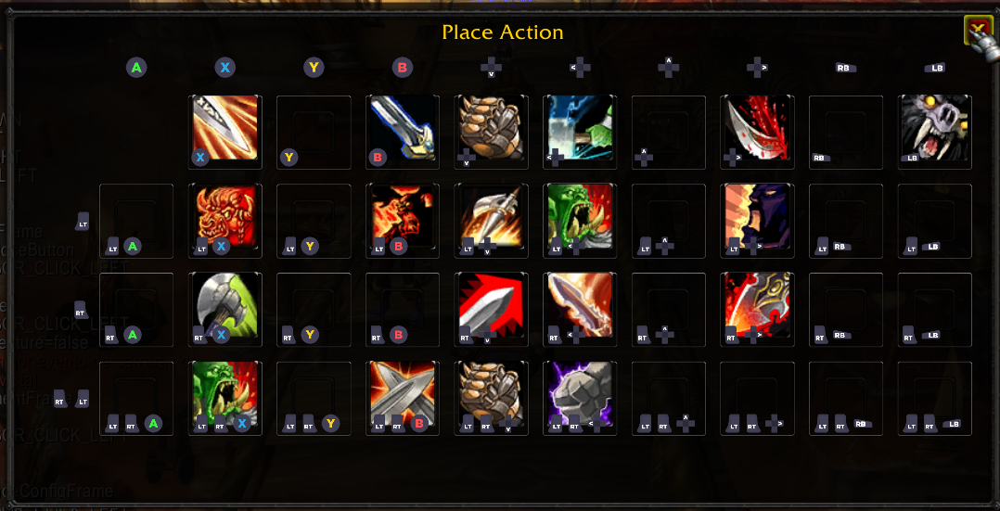
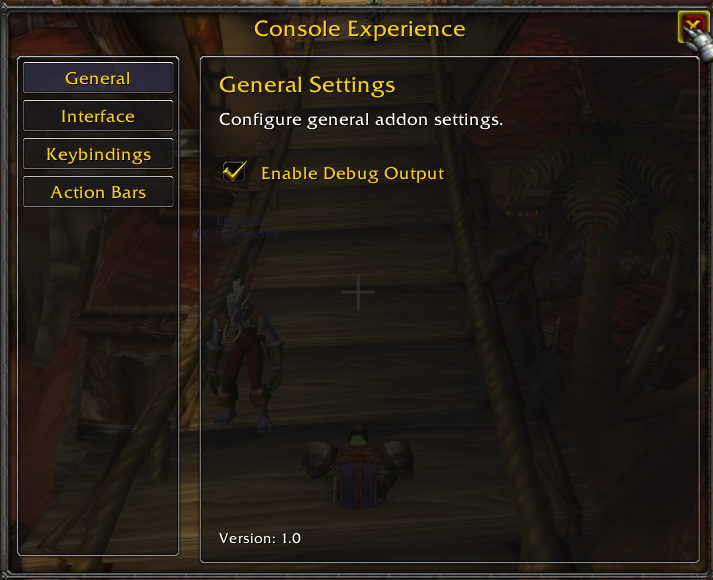

# ConsoleExperience Classic

A comprehensive controller-style interface addon for World of Warcraft: Vanilla (1.12.1) that transforms the game into a fully playable experience using a gamepad or controller-style keyboard navigation.

> **⚠️ WARNING: This addon is in a really early alpha development stage. Expect bugs, incomplete features, and potential issues. Use at your own risk.**

## Overview

ConsoleExperience Classic provides a complete controller-friendly interface for WoW Vanilla, featuring gamepad-style action bars, cursor navigation, radial menus, and extensive customization options. The addon enables players to enjoy World of Warcraft with a controller or keyboard-only navigation system.

## Features

### 🎮 Controller-Style Action Bars
- **Gamepad Layout**: Two-star action bar layout (D-pad and face buttons) with 40 action slots
- **Modifier Support**: Four action bar pages using LT, RT, and LT+RT modifiers
- **Visual Controller Icons**: Each button displays controller button icons (A, B, X, Y, LB, RB, D-pad)
- **Customizable Layout**: Adjustable button size, padding, position, and scale
- **Jump Binding**: Optional direct jump binding for the A button

### 🖱️ Cursor Navigation System
- **Fake Cursor**: Visual cursor overlay for navigating UI elements
- **Automatic Frame Detection**: Automatically hooks into major UI frames (Character, Spellbook, Bags, Quest Log, etc.)
- **Directional Navigation**: Navigate UI elements using D-pad (UP, DOWN, LEFT, RIGHT)
- **Smart Wrapping**: When reaching the edge of a grid, automatically wraps to the opposite side on the same row/column
- **Context-Sensitive Actions**: Different actions available based on the hovered element (Pickup, Place, Clear, etc.)
- **Visual Feedback**: Highlighted buttons and tooltips showing available actions

### 📋 Spell & Item Placement
- **Placement Frame**: Visual grid for organizing spells, macros, and items
- **Drag & Drop**: Intuitive drag-and-drop interface for action bar management
- **Controller Icon Overlays**: Each slot shows which controller button activates it
- **Modifier Indicators**: Visual indicators for LT, RT, and LT+RT combinations

### 🎯 Radial Menu
- **Quick Access Menu**: Circular menu for fast access to common game functions
- **13 Menu Items**: Character, Inventory, Spellbook, Talents, Quest Log, World Map, Social, Guild, LFG, and more
- **Controller Navigation**: Navigate menu items using controller input
- **Toggle Binding**: Accessible via SHIFT+ESCAPE

### ⌨️ Keybinding Management
- **Default Bindings**: Pre-configured bindings for controller-style gameplay
- **Reset Function**: One-click reset to restore default bindings
- **Jump Configuration**: Toggle between jump action and custom action for A button
- **Binding Persistence**: All bindings are saved and restored automatically

### 🛠️ Configuration System
- **In-Game Config Menu**: Access via `/ce` command
- **Multiple Sections**: General, Interface, Keybindings, and Action Bars
- **Real-Time Updates**: Changes apply immediately without reload
- **Debug Mode**: Optional debug output for troubleshooting

### 📝 Macro Management
- **Default Macros**: Pre-configured macros for common actions (Target Nearest Enemy)
- **Auto-Placement**: Macros automatically placed on action bars
- **Reset Function**: Restore default macros with one click

### 🎨 Customization Options
- **Action Bar Layout**: Adjust size, padding, position, and scale
- **Crosshair Display**: Optional crosshair for screen center reference
- **Tooltip System**: Enhanced tooltips with controller button icons
- **Visual Feedback**: Highlighted elements and action prompts

## Installation

1. Download the latest release from the repository
2. Extract the `ConsoleExperienceClassic` folder
3. Copy it to your `World of Warcraft/Interface/AddOns/` directory
4. Restart World of Warcraft
5. Enable the addon in the character selection screen

## Usage

### Steam Input Setup

**Important**: For the best experience, use the **"WoW Vanilla Console experience by p3p0 v1"** Steam Input distribution.

1. Launch World of Warcraft through Steam
2. Open Steam Big Picture mode or Steam overlay
3. Navigate to Controller Settings
4. Select "Browse Configs" → "Community"
5. Search for: **"WoW Vanilla Console experience by p3p0 v1"**
6. Apply the configuration
7. **Important**: Reconfigure the right joystick action (move cursor) to match your screen resolution. The profile is configured for 1920x1200 resolution, so you'll need to adjust the cursor movement coordinates in the right joystick settings to match your display resolution and the crosshair position.
8. The addon will automatically detect and work with this configuration

### Basic Controls

- **D-Pad**: Navigate UI elements and move cursor
- **A Button**: Confirm/Click/Place items
- **B Button**: Cancel/Back/Clear slots
- **X Button**: Pickup items/spells
- **Y Button**: Additional actions (context-dependent)
- **LT/RT**: Modifier keys for additional action bar pages
- **SHIFT+ESCAPE**: Toggle radial menu

### Opening Configuration

Type `/ce` in chat to open the configuration menu.

### Action Bar Pages

- **Page 1** (No modifiers): Base action bar (slots 1-10)
- **Page 2** (LT): Left Trigger modifier (slots 11-20)
- **Page 3** (RT): Right Trigger modifier (slots 21-30)
- **Page 4** (LT+RT): Both triggers (slots 31-40)

### Cursor Navigation

When UI frames are open (Character, Spellbook, Bags, etc.), the cursor navigation system automatically activates:
- Use D-pad to move between interactive elements
- A button to select/click
- B button to cancel/close
- The cursor will automatically wrap around grids (e.g., inventory bags)

### Placing Spells/Items

1. Open the Spellbook or Inventory
2. Navigate to the spell/item using cursor navigation
3. Press X button to pick up
4. The Placement Frame will automatically appear
5. Navigate to desired slot using D-pad
6. Press A button to place
7. Press B button on a slot to clear it

## Roadmap

### Planned Features

- **Increased Frame Support**: Expand automatic hooking to more UI frames and addons
- **Auto Targeting System**: Intelligent target selection and management for combat
- **Healer Mode**: Specialized interface and targeting system for healing classes
- **Ring Menus**: Additional ring menus to expand the bindings and capabilities.

## Support & Donations

If you enjoy using ConsoleExperience Classic and want to support its development, consider buying me a coffee:

Your support helps maintain and improve the addon!

## Compatibility

- **WoW Version**: Vanilla (1.12.1)
- **Dependencies**: None (standalone addon)
- **Saved Variables**: Per-character configuration storage

## Contributing

Contributions are welcome! Please feel free to submit issues, feature requests, or pull requests.

## Credits

- **Author**: pepordev
- **Version**: 0.0.1
- **Special Thanks**: @luskanek for his support, help and guidance, the rest of the addon developer community, and the user community for feedback and testing

**Note**: This addon is designed specifically for World of Warcraft: Vanilla (1.12.1). It may not work correctly with other WoW versions or private server modifications.

