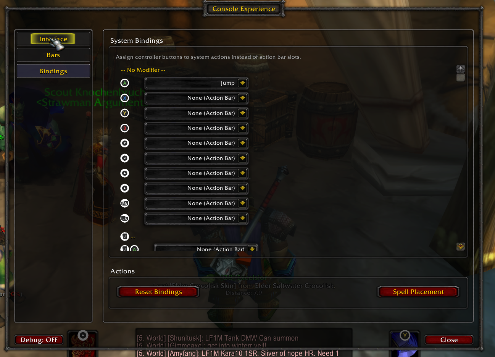

# Configuration Guide

Open the configuration panel with `/ce` or `/consoleexperience`.

## General Settings

| Setting | Description | Default |
|---------|-------------|---------|
| Debug Mode | Show debug messages in chat | Off |
| Language | UI language (or auto-detect) | Auto |

## Interface Settings

### Crosshair
| Setting | Description | Default |
|---------|-------------|---------|
| Enable Crosshair | Show targeting crosshair | On |
| X Offset | Horizontal position | 0 |
| Y Offset | Vertical position | 50 |
| Size | Crosshair size in pixels | 24 |
| Type | "cross" or "dot" | cross |
| Color | RGBA color picker | White (80% opacity) |

### Controller Type
| Setting | Description | Default |
|---------|-------------|---------|
| Controller Type | "xbox" or "ps" button icons | xbox |

### Other Options
| Setting | Description | Default |
|---------|-------------|---------|
| Open all bags at vendor | Auto-open bags at merchants/bank | Off |

## Action Bar Settings

### Layout
| Setting | Description | Default |
|---------|-------------|---------|
| Appearance | "Classic" or "Modern" style | Classic |
| Button Size | Size of action buttons (20-80) | 60 |
| Padding | Space between buttons (0-100) | 65 |
| Star Padding | Distance between left/right groups | 600 |
| X Offset | Horizontal position offset | 0 |
| Y Offset | Vertical position from bottom | 70 |
| Scale | Overall scale (0.5-2.0) | 1.0 |

### Auto Spell Rank
| Setting | Description | Default |
|---------|-------------|---------|
| Auto-update spells | Update to highest rank automatically | On |

### Side Action Bars (Touch Screen)
| Setting | Description | Default |
|---------|-------------|---------|
| Enable Left Side Bar | Show left vertical bar | Off |
| Enable Right Side Bar | Show right vertical bar | Off |
| Left Buttons (1-5) | Number of buttons on left bar | 3 |
| Right Buttons (1-5) | Number of buttons on right bar | 3 |

> **Note:** Side bars use action slots 41-45 (left) and 46-50 (right). They share button size, padding, and scale settings with the main action bars.

## Chat Settings

| Setting | Description | Default |
|---------|-------------|---------|
| Width | Chat frame width | 400 |
| Height | Chat frame height | 150 |
| Bottom Y | Distance from screen bottom | 20 |
| Virtual Keyboard | Show keyboard when typing | On |

## XP/Rep Bar Settings

### XP Bar
| Setting | Description | Default |
|---------|-------------|---------|
| Always Visible | Keep XP bar visible | On |
| Width | Bar width (0 = chat width) | 0 |
| Height | Bar height (min 20) | 20 |
| Timeout | Seconds before fade (if not always visible) | 5.0 |
| Show Text | Display percentage text | On |

### Reputation Bar
| Setting | Description | Default |
|---------|-------------|---------|
| Always Visible | Keep rep bar visible | Off |
| Width | Bar width (0 = chat width) | 0 |
| Height | Bar height (min 20) | 20 |
| Timeout | Seconds before fade | 5.0 |
| Show Text | Display percentage text | On |

## Cast Bar Settings

| Setting | Description | Default |
|---------|-------------|---------|
| Enable Cast Bar | Show custom cast bar | On |
| Height | Bar height | 20 |
| Color | Cast bar color | Blue |

## Bindings Settings

The Bindings section allows you to assign controller buttons to system actions instead of action bar slots.



### System Bindings
| Setting | Description | Default |
|---------|-------------|---------|
| Slot 1 (A) | System action for A button | Jump |
| Slot 30 (RT+LB) | System action for RT+LB | Interact |
| Other Slots | Can be assigned to any system action | None (Action Bar) |

### Available System Actions
- **Movement:** Jump, Toggle Auto Run, Sit/Stand
- **Targeting:** Target Nearest Enemy, Target Previous Enemy, Target Nearest Friend, Assist Target, Target Pet, Clear Target
- **Interface:** Toggle Map, Open All Bags, Toggle Character, Toggle Spellbook, Toggle Talents
- **Camera:** Zoom In, Zoom Out
- **Combat:** Attack, Pet Attack, Stop Attack
- **Custom:** Interact (requires Interact.dll)

### Actions
| Setting | Description |
|---------|-------------|
| Reset Bindings | Reset all keybindings to defaults |
| Spell Placement | Open the spell placement frame |

## Slash Commands

| Command | Description |
|---------|-------------|
| `/ce` or `/consoleexperience` | Open configuration |
| `/cerank debug` | Show all spells on action bars |
| `/cerank update` | Update spells to highest rank |

## Config File Location

Settings are saved per-character in:
```
WTF/Account/<Account>/SavedVariables/ConsoleExperienceClassic.lua
```

## Resetting Configuration

To reset all settings to defaults:
1. Log out of the game
2. Delete the saved variables file above
3. Log back in
