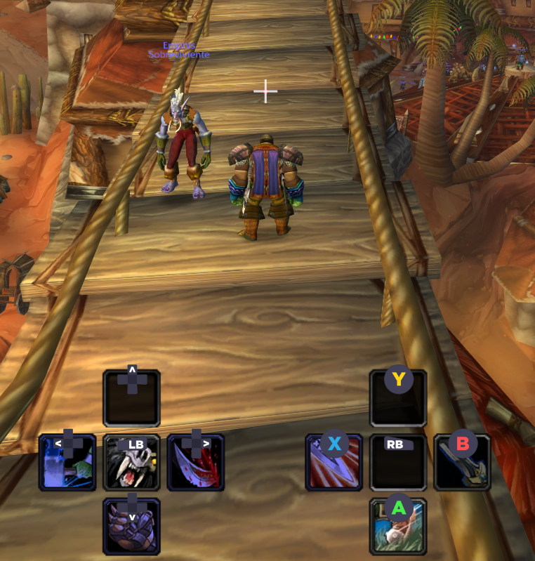

# ConsoleExperienceClassic

A controller-friendly addon for World of Warcraft 1.12 (Vanilla) that provides a console-style gaming experience with gamepad support, custom UI elements, and quality-of-life features.

## Features

- **🎮 Gamepad-Style Action Bars** - Controller-optimized button layout with visual button prompts
- **🔗 System Bindings** - Assign controller buttons to system actions (Jump, Auto Run, etc.)
- **🎯 Cursor Navigation** - Navigate UI elements with controller/keyboard
- **📻 Radial Menu** - Quick access menu for common actions
- **⌨️ Virtual Keyboard** - On-screen keyboard for chat input
- **💬 Chat Integration** - Repositioned chat frame with controller-friendly input
- **📊 XP/Reputation Bars** - Custom progress bars below chat
- **🔮 Cast Bar** - Custom casting bar above chat
- **🔄 Auto Spell Rank** - Automatically updates spells to highest rank
- **⚙️ Full Configuration** - Extensive options for customization

## Quick Start

1. [Install the addon](Installation.md)
2. Log into the game
3. Use `/ce` or `/consoleexperience` to open configuration
4. Customize settings to your preference

## Documentation

- [Installation Guide](Installation.md)
- [Configuration Options](Configuration.md)
- **Features:**
  - [Action Bars](features/ActionBars.md)
  - [Cursor Navigation](features/CursorNavigation.md)
  - [Radial Menu](features/RadialMenu.md)
  - [Virtual Keyboard](features/Keyboard.md)
  - [XP/Rep Bars](features/XPBars.md)
  - [Cast Bar](features/CastBar.md)
  - [Auto Spell Rank](features/AutoRank.md)
- [Keybindings](Keybindings.md)
- [Troubleshooting](Troubleshooting.md)

## Screenshots

## Requirements

- World of Warcraft 1.12.1 (Vanilla) or TurtleWoW
- Optional: Xbox/PlayStation controller

## Support

- Report issues on [GitHub Issues](https://github.com/yourusername/ConsoleExperienceClassic/issues)
- Check the [Troubleshooting Guide](Troubleshooting.md) for common problems

## License

This addon is open source. Feel free to modify and distribute.
